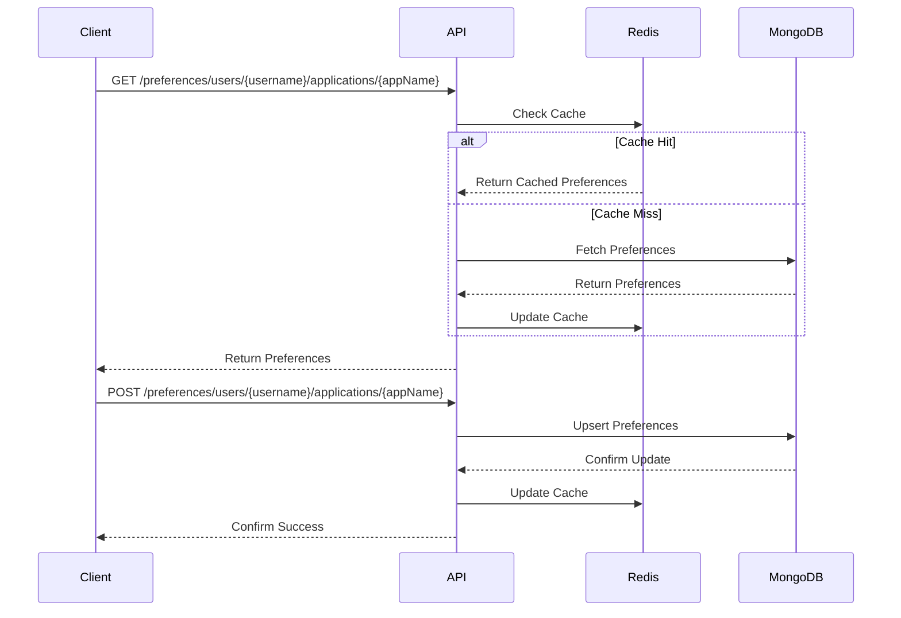

# Fingerprint Preferences Service

A microservice for managing user preferences across different applications with MongoDB storage and Redis caching.

## Overview

This service provides a REST API for storing and retrieving user preferences for different applications. It uses MongoDB as the primary storage and Redis for caching to improve read performance.

## Architecture

### Sequence Flow



## API Endpoints

### Get Preferences
```http
GET /api/v1/preferences/users/{username}/applications/{appName}
```
Retrieves preferences for a specific user and application.

### Set Preferences
```http
POST /api/v1/preferences/users/{username}/applications/{appName}
```
Updates preferences for a specific user and application.

## Setup

### Prerequisites
- Go 1.22 or higher
- MongoDB
- Redis
- Docker (optional)

### Environment Variables
```bash
MONGO_CONNECTION_STRING=mongodb://localhost:27017
REDIS_CONNECTION_STRING=localhost:6379
```

### Running Locally
```bash
go run main.go
```

## Data Structure

### MongoDB Document Structure
```json
{
    "username": "string",
    "appName": "string",
    "preferences": {
        "key1": "value1",
        "key2": "value2"
    }
}
```

### Redis Cache Structure
- Key: `{username}-{appName}`
- Value: JSON string of preferences

## Features
- REST API for preference management
- MongoDB persistence
- Redis caching for improved read performance
- Automatic cache invalidation on updates
- Concurrent request handling

## Error Handling
- Invalid requests return 400 Bad Request
- Database errors are logged and return 500 Internal Server Error
- Cache misses are handled gracefully with database fallback

## Contributing
1. Fork the repository
2. Create your feature branch (`git checkout -b feature/amazing-feature`)
3. Commit your changes (`git commit -m 'Add some amazing feature'`)
4. Push to the branch (`git push origin feature/amazing-feature`)
5. Open a Pull Request

## License
This project is licensed under the MIT License - see the LICENSE file for details
```

This README includes:
1. A clear overview of the project
2. A sequence diagram showing the flow of data
3. API endpoint documentation
4. Setup instructions
5. Data structure explanations
6. Key features
7. Error handling information
8. Contributing guidelines

The sequence diagram clearly shows how requests flow through the system, including the caching layer and database interactions. Let me know if you'd like any modifications or additional sections added to the README.
